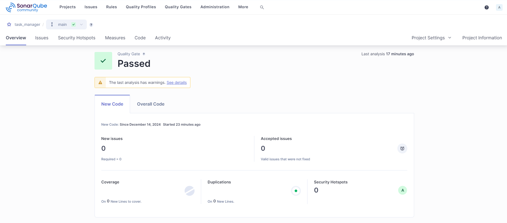

# Task Manager - Flask Web Application

## Descripción

Este es un proyecto de Gestión de Tareas desarrollado con Flask y SQLAlchemy como base para el backend, y utiliza HTML y CSS en el frontend. Permite a los usuarios crear, listar, completar, eliminar, guardar y cargar tareas mediante un archivo JSON.

## Funcionalidades Principales
```
    ✏️ Crear tareas: Agregar tareas con un título y una descripción.
    📝 Listar tareas: Ver todas las tareas en una tabla, junto con su estado.
    ✅ Completar tareas: Marcar tareas como completadas.
    ❌ Eliminar tareas: Borrar tareas individuales de la lista.
    📥 Guardar tareas: Descargar la lista de tareas como un archivo JSON.
    📤 Cargar tareas: Subir un archivo JSON para cargar tareas previamente guardadas.
```


## Tecnologías Utilizadas

#### *Backend:*

- **Flask:** Framework para aplicaciones web en Python.
- **SQLAlchemy:** ORM para gestionar la base de datos SQLite.

#### *Frontend:*

- **HTML:** Estructura de la interfaz.

- **CSS:** Estilos de la aplicación.

#### *Base de Datos:*

- **SQLite:** Base de datos ligera y sencilla para almacenar las tareas.

## Instalación

Sigue estos pasos para configurar el proyecto en tu entorno local:

### Clona este repositorio:
```bash
    git clone https://github.com/James2910/task_manager.git
    cd <NOMBRE_DEL_DIRECTORIO_DONDE_CLONASTE_EL_PROYECTO>
```

### Crea un entorno virtual e instálalo:
```bash
    # Ejecuta los siguientes comandos (Windows):
    virtualenv -p python3 env
    .\env\scripts\activate  
    pip install Flask SQLAlchemy
```

## Inicia la aplicación:
```bash
    py .\app\app.py

    Abre el navegador en http://127.0.0.1:5000 para usar la aplicación.
```

## Resultado SonarQube
